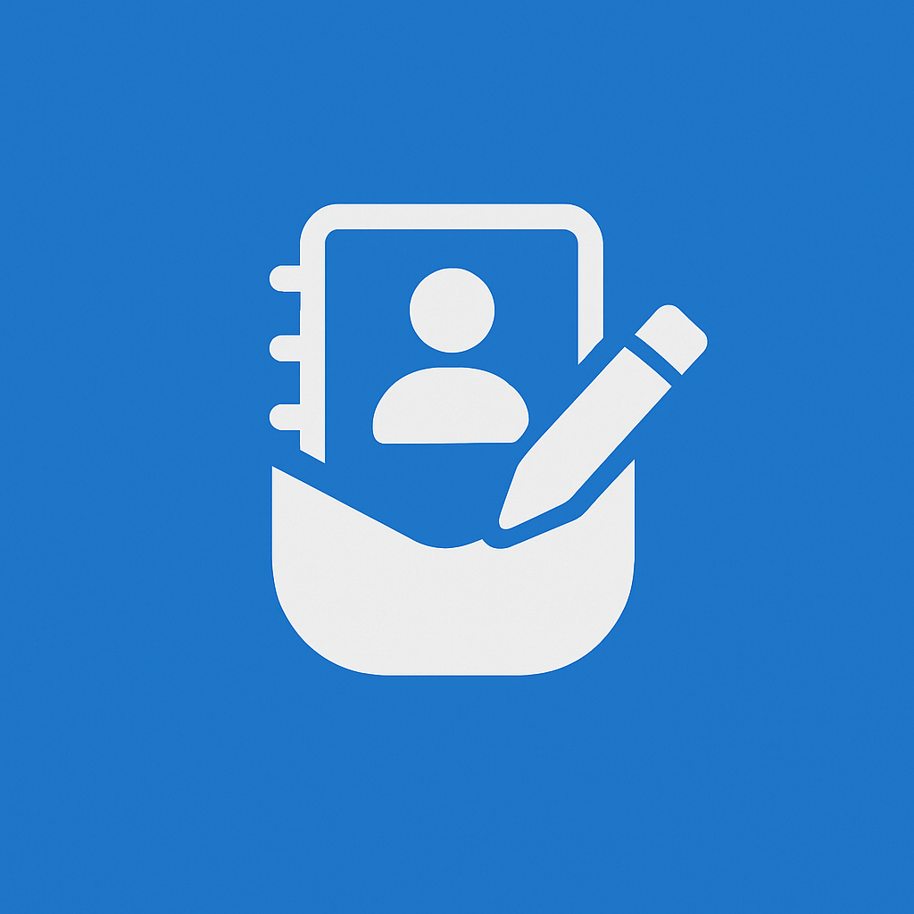

  
  <h1 style="margin-bottom: 0.5rem;">PocketLog</h1>
  
Your private, people-first journal for nurturing relationships that matter.

  <a href="https://apps.apple.com/app/pocketlog" style="display: inline-block; background: #007AFF; color: white; padding: 12px 24px; border-radius: 8px; text-decoration: none; font-weight: 600;">Download on the App Store</a>

---

PocketLog helps you remember every meaningful interaction and stay connected with the people in your life. Whether you're managing professional relationships, keeping up with friends, or simply wanting to be more intentional about your connections — PocketLog is your personal CRM that respects your privacy.

---

## Features

<h3 style="margin-top: 0;">📝 Remember Everything</h3>
<ul style="margin-bottom: 0;">
<li>Log conversations, meetings, and meaningful moments</li>
<li>Attach photos and files to capture full context</li>
<li>Add locations to remember where connections happened</li>
<li>Backdate entries for past events you want to document</li>
</ul>

<h3 style="margin-top: 0;">🔔 Stay in Touch</h3>
<ul style="margin-bottom: 0;">
<li>Set personalized check-in reminders for each contact</li>
<li>See at a glance who needs your attention</li>
<li>Track days since your last interaction</li>
<li>Never let important relationships slip away</li>
</ul>

<h3 style="margin-top: 0;">🗂️ Organize Your Way</h3>
<ul style="margin-bottom: 0;">
<li>Create groups for work, family, friends, or any category</li>
<li>Add custom fields to track what matters to you</li>
<li>Search across all your logs and contacts instantly</li>
<li>View a complete timeline for each relationship</li>
</ul>

<h3 style="margin-top: 0;">🔒 Privacy First</h3>
<ul style="margin-bottom: 0;">
<li>All data stays on your device by default</li>
<li>Optional iCloud sync across your Apple devices</li>
<li>No accounts required, no tracking, no ads</li>
<li>Your relationships are your business</li>
</ul>

---

## Frequently Asked Questions

Getting Started

<strong>How do I add a new contact?</strong> 
Tap the "+" button on the Contacts tab to create a new contact. You can add their name, company, phone, email, and any custom fields you need.

<strong>How do I log an interaction?</strong> 
Tap the "+" button on the Logs tab, or tap "Add Log" from a contact's detail page. Write about your interaction, add photos or files, set the date, and link it to one or more contacts.

<strong>Can I import my existing contacts?</strong> 
PocketLog can sync with your device's contact groups. Go to Settings &gt; Contact Groups to import groups from your Contacts app.

Needs Attention & Check-in Reminders

<strong>What is the "Needs Attention" feature?</strong> 
The Dashboard shows contacts who are due for a check-in based on their reminder frequency. If you set a contact to "remind me every 2 weeks" and it's been more than 2 weeks since your last log with them, they'll appear in the "Needs Attention" section.

<strong>How do check-in reminders work?</strong> 
For each contact, you can enable "Remind me to check in" and set a frequency (weekly, every 2 weeks, monthly, quarterly, etc.). PocketLog tracks the date of your most recent log with that contact and calculates when you're due to reconnect.

<strong>How do I enable/disable reminders for a contact?</strong> 
Open the contact's detail page, tap Edit, and toggle the "Remind me to check in" option. You can also set the reminder frequency there.

<strong>What counts as a "check-in"?</strong> 
Creating a log entry linked to a contact counts as checking in with them. The log date (not the creation date) is used to calculate when you last connected.

Custom Fields

<strong>What are custom fields?</strong> 
Custom fields let you track additional information about contacts beyond the standard fields. You can create fields for things like "Met at," "Relationship type," "Preferred contact method," anniversaries, or any other data you want to track.

<strong>What types of custom fields can I create?</strong>

<ul>
<li><strong>Text / Long Text</strong> — Free-form text (e.g., "Notes," "Met at")</li>
<li><strong>Number / Currency</strong> — Numeric values (e.g., "Years known," "Budget")</li>
<li><strong>Date</strong> — Important dates with reminders (e.g., "Anniversary," "Contract renewal")</li>
<li><strong>Single/Multi Select</strong> — Predefined options (e.g., "Priority: High/Medium/Low")</li>
<li><strong>Boolean</strong> — Yes/No toggle (e.g., "VIP," "Active client")</li>
<li><strong>Contact Info</strong> — URL, Email, Phone, Address fields</li>
</ul>

<strong>How do I create a custom field?</strong> 
Go to Settings &gt; Custom Fields &gt; Add Field. Choose a name, type, and any options. Once created, the field will be available when editing any contact.

<strong>Can I set reminders for date custom fields?</strong> 
Yes! When you add a date to a custom field (like an anniversary), you can enable reminders. Choose whether it's a one-time or annual recurring reminder, and select when to be notified (on the day, 1 day before, 3 days before, or 1 week before).

Upcoming Dates

<strong>Where can I see upcoming birthdays and dates?</strong> 
The Dashboard includes an "Upcoming Dates" section that shows birthdays and custom date fields (like anniversaries) that are coming up soon. This gives you a unified view of important dates across all your contacts.

<strong>How far in advance are upcoming dates shown?</strong> 
By default, dates within the next 5 days are shown. You can adjust this window in Settings.

Notifications & Reminders

<strong>How do log reminders work?</strong> 
When creating or editing a log, you can set a reminder for a future date/time. PocketLog will send you a notification at the scheduled time to remind you about that log entry.

<strong>How do todo reminders work?</strong> 
Each todo can have an optional due date with a reminder. You'll receive a notification when a todo is due. You can set reminders when creating or editing a todo.

<strong>Do I need to allow notifications?</strong> 
Yes. When you first enable a reminder feature, PocketLog will ask for notification permissions. You can manage these in your device's Settings &gt; PocketLog &gt; Notifications.

<strong>What happens if I miss a notification?</strong> 
Notifications are delivered based on your device settings. If you miss one, the item will still appear in your Needs Attention section (for contacts) or your todo list (for tasks). We recommend enabling notification sounds and banners for important reminders.

Data & Privacy

<strong>Where is my data stored?</strong> 
All your data is stored locally on your device by default. If you enable iCloud sync, your data (including imported contacts, logs, todos, and attachments) is also synced to your private iCloud account.

<strong>What happens when I import contacts?</strong> 
Imported contacts are stored locally on your device. If you have iCloud Sync enabled, they will also be synced to your private iCloud. The app clearly shows your sync status when importing contacts. We do not send contact data to any third-party servers.

<strong>Can I backup my data?</strong> 
Yes! Go to Settings &gt; Backup &amp; Restore to create a backup file (JSON format) that you can save or share. You can restore from this backup at any time. Note: Backup files are not encrypted, so store them in a secure location.

<strong>Is my data shared with anyone?</strong> 
No. PocketLog does not collect, share, or sell any of your data. Your information never leaves your device unless you explicitly enable iCloud sync (which syncs only to your own private iCloud account).

Troubleshooting

<strong>My data isn't syncing across devices</strong> 
Make sure iCloud is enabled in Settings &gt; iCloud Sync. Ensure you're signed into the same Apple ID on all devices and have a stable internet connection.

<strong>I'm not receiving notifications</strong> 
Check that notifications are enabled in Settings &gt; PocketLog &gt; Notifications on your device. Also ensure Do Not Disturb is not blocking alerts.

<strong>I accidentally deleted something</strong> 
Unfortunately, deleted items cannot be recovered unless you have a backup. We recommend creating regular backups in Settings &gt; Backup &amp; Restore.

<strong>The app is running slowly</strong> 
Try closing and reopening the app. If the issue persists, ensure your device has sufficient storage space and is running the latest iOS version.

---

## Contact & Support

<h3 style="color: white; margin-top: 0;">Need Help?</h3>

We're here to help! If you have questions, feedback, or need assistance:

<a href="mailto:pocketlog.app@gmail.com" style="color: white; text-decoration: underline;">pocketlog.app@gmail.com</a>

Please include your device model, iOS version, and screenshots if applicable. 
We typically respond within 24-48 hours.

---

<a href="privacy" style="margin: 0 1rem; color: #586069;">Privacy Policy</a>
|
<a href="terms" style="margin: 0 1rem; color: #586069;">Terms of Use</a>

© 2025 PocketLog. All rights reserved.

